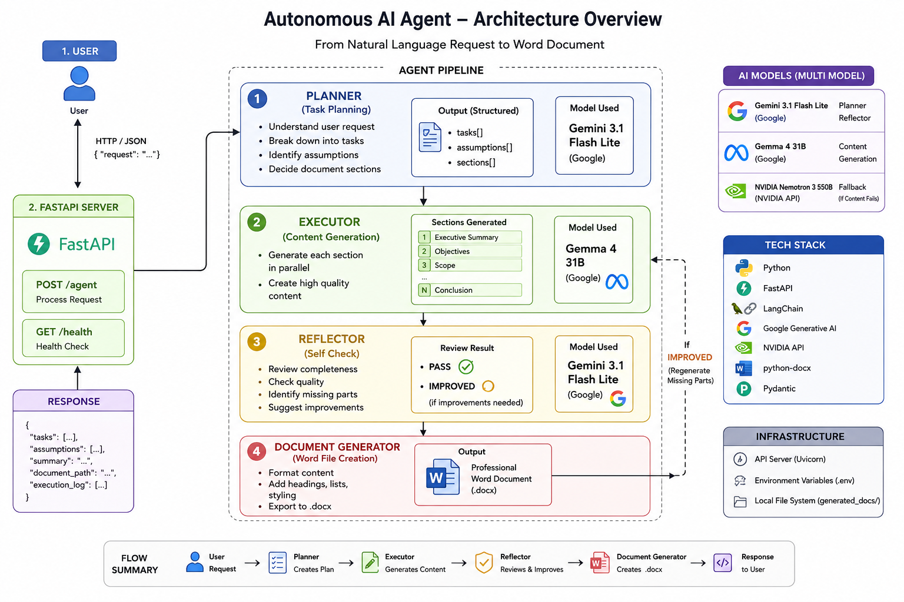
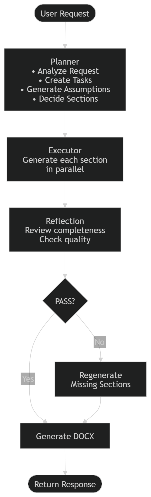

# Autonomous AI Agent

A Python-based autonomous AI agent that accepts natural language requests, plans tasks, executes them, and generates professional Word (.docx) documents.

Built with FastAPI, LangChain, Gemini API, and python-docx.

## Architecture



## Agent Workflow



## Folder Structure

```
project/
  app.py                  FastAPI application with routes
  config.py               Environment variables and settings
  requirements.txt        Dependencies
  README.md               This file
  generated_docs/         Output .docx files
  agent/
    planner.py            Task planning with structured output
    executor.py           Section-by-section content generation
    reflector.py          Quality review and self-check
    workflow.py           Orchestrates the full pipeline
  prompts/
    planner_prompt.py     Prompt template for planning
    executor_prompt.py    Prompt template for content generation
    reflection_prompt.py  Prompt template for quality review
  services/
    llm.py                Gemini LLM wrapper
    document_generator.py python-docx document builder
  models/
    request.py            Request schema
    response.py           Response schema
    planner_output.py     Planner output schema
```

## Installation

```bash
cd project
pip install -r requirements.txt
```

## Environment Variables

Create a `.env` file in the `project/` directory:

```
GEMINI_API_KEY=your_gemini_api_key_here
```

Get a free API key at [Google AI Studio](https://makersuite.google.com/app/apikey).

## Running Locally

```bash
uvicorn app:app --reload
```

The API will be available at `http://localhost:8000`.

## API

### POST /agent

Accepts a natural language request and returns a structured response with a generated document.

**Request:**

```json
{
  "request": "Write a project proposal for a customer loyalty mobile app for a retail chain with 50 stores. Include budget estimates and timeline."
}
```

**Response:**

```json
{
  "tasks": [
    { "id": 1, "description": "Define project objectives" },
    { "id": 2, "description": "Outline scope and deliverables" }
  ],
  "assumptions": [
    "Assuming a budget of $50,000-$100,000",
    "Assuming 50 stores across the region"
  ],
  "summary": "Generated Project Proposal: Customer Loyalty Mobile App with 6 sections based on 5 planned tasks.",
  "document_path": "generated_docs/project_proposal_customer_loyalty_20260704_143022.docx",
  "execution_log": [
    { "step": "Planning", "status": "success", "details": "Identified 5 tasks, 2 assumptions, 6 sections" },
    { "step": "Execution", "status": "success", "details": "Generated 6 sections" },
    { "step": "Reflection", "status": "success", "details": "All sections meet quality standards." },
    { "step": "Document Generation", "status": "success", "details": "Saved to generated_docs/..." }
  ]
}
```

### GET /

Returns API information and available endpoints.

### GET /health

Returns `{ "status": "healthy" }`.

## Example Requests

### Standard Request

```bash
curl -X POST http://localhost:8000/agent \
  -H "Content-Type: application/json" \
  -d '{"request": "Write a project proposal for a customer loyalty mobile app for a retail chain with 50 stores. Include budget estimates and timeline."}'
```

### Complex Request

```bash
curl -X POST http://localhost:8000/agent \
  -H "Content-Type: application/json" \
  -d '{"request": "I need a document for our team quarterly review. We missed our targets last quarter. Revenue was down 15%. Make it professional but honest. I am not sure what sections to include."}'
```

## Engineering Feature: Reflection / Self-Check

The reflector module (`agent/reflector.py`) implements a self-check mechanism:

1. After content is generated, the reflector sends it to the LLM for review
2. The LLM checks for completeness, professionalism, and quality
3. If sections are missing or poorly written, it identifies what needs improvement
4. Missing content is generated and merged into the final document
5. Single-pass design keeps complexity low while improving output quality

## Engineering Decisions

- **Pipeline architecture** over dynamic agent loops: Predictable, debuggable, easy to trace failures
- **Per-section generation** over monolithic generation: Better organization, modular, easier to review
- **PydanticOutputParser** for structured planning output: No regex parsing, type-safe, clean
- **Gemini Free API**: Zero cost, good quality, accessible
- **Single-pass reflection**: Simple, no infinite loops, sufficient for document quality

## Multi-Model Architecture


## Tradeoffs

| Choice | Benefit | Cost |
|--------|---------|------|
| Pipeline vs Agent Loop | Predictable, debuggable | Less flexible for open-ended tasks |
| Per-section vs Monolithic | Better quality, modular | More LLM calls, slower |
| Gemini vs Paid models | Free, good quality | Rate limits, requires internet |
| Single-pass reflection | Simple, fast | May miss subtle issues |

## Future Improvements

- Streaming responses for real-time progress
- Multi-agent architecture for complex workflows
- RAG integration for company-specific knowledge
- Conversation memory for multi-turn interactions
- Web search tool for up-to-date information
